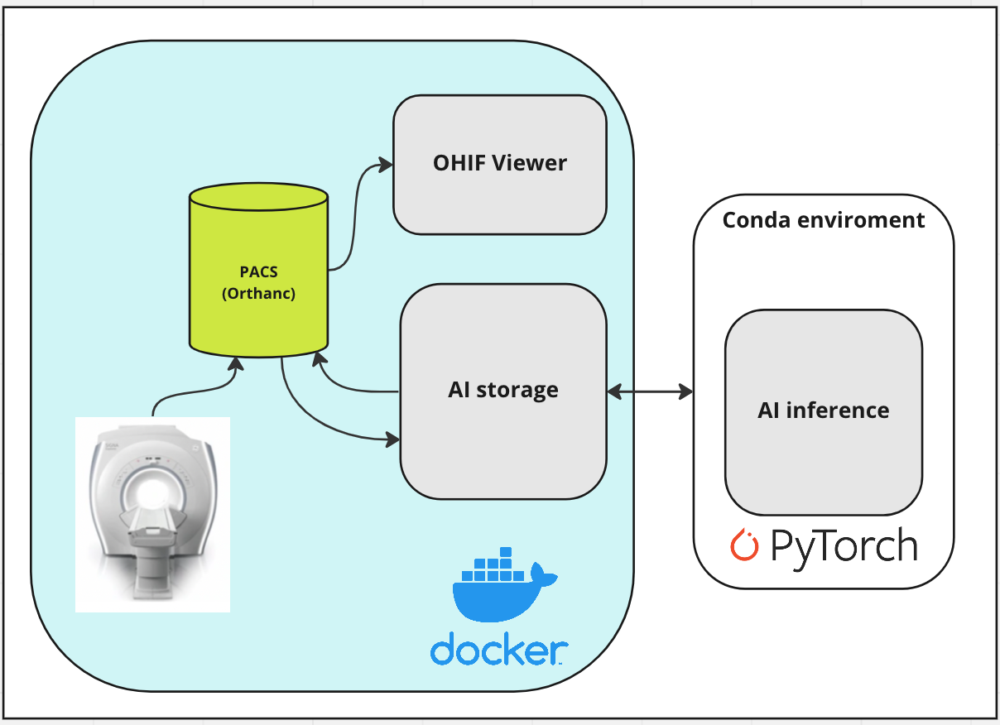
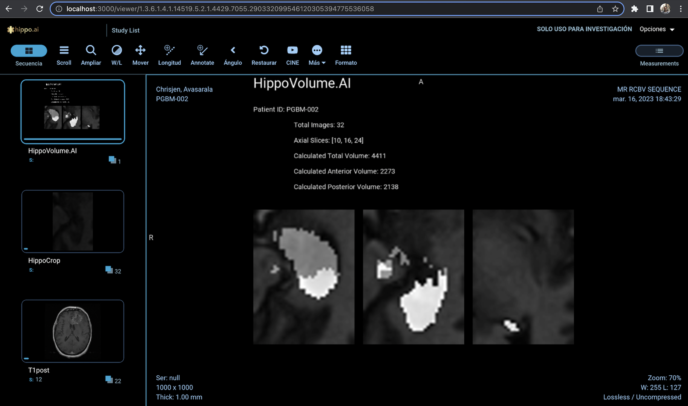

# Quantifying Hippocampus Volume for Alzheimer's Progression

This project aims to develop an end-to-end AI system that assists in the diagnosis and tracking of Alzheimer's disease (AD) progression by quantifying hippocampus volume through MRI exams. It is based on the final project for 3D images for [AI for Healthcare](https://www.udacity.com/course/ai-for-healthcare-nanodegree--nd320) from Udacity. 

## Background
Alzheimer's disease is a progressive neurodegenerative disorder that leads to impaired brain cell function and eventually cell death. It is the most common cause of dementia and is characterized by memory loss, inability to learn new material, loss of language function, and other manifestations.

The hippocampus is a critical structure of the human brain that plays important roles in the consolidation of information from short-term memory to long-term memory. Measuring hippocampal volume using MRI exams has proven useful in diagnosing and tracking progression in several brain disorders, most notably in Alzheimer's disease.

The intention of the project was to build a machine learning algorithm that integrates into a clinical-grade viewer and automatically measures hippocampal volumes of new patients, as their studies are committed to the clinical imaging archive.

The dataset used in this project contains segmentations of the right hippocampus trained with hippocampus dataset provided by [Medical Segmentation Decathlon](http://medicaldecathlon.com/) using U-Net architecture from [Division of Medical Image Computing, German Cancer Research Center (DKFZ)](https://github.com/MIC-DKFZ). 

Trained model was connected into a working clinical PACS to run on every incoming study and produce a report with volume measurements.

Additional data on exploration data analysis (EDA) and training can be explored in eda and training folders. 

### Network arquitecture
The arquitecture was adapted from [here](https://github.com/qureai/ohif-docker-compose) adding a new container to exec DMCTK operations to create a DICOM modality to connect with Orthanc server. 
For keeping it simplier and faster the conda enviroment for inference will run out of Docker.




### Getting Started
- Clone the repository to a folder destination
```
git clone https://github.com/maicobernal/segmentation
```
- Install Python 3.8 and Docker on your system, following the instructions for your operating system.
- Create a conda enviroment:
```
conda env create -f environment.yml
conda activate hippo-ai
```

- Install the DCMTK package according to your operating system:
    - [Ubuntu/Debian](https://packages.debian.org/sid/dcmtk)
    - [Windows](https://support.dcmtk.org/redmine/projects/dcmtk)
    - [macOS](https://formulae.brew.sh/formula/dcmtk)

- Start the required Docker containers. 
```
docker compose up
```
If you need to build an image for your operating system (different CPU arquitecture) you can check instructions on how to do it on the docker-compose.yml file. 

- Download the trained model from [here](https://drive.google.com/file/d/1_-4vo8W4IQn6OTodDfBlKkpAKZf74HcC/view?usp=sharing) and store it on assets/model path

- There are three sample studies to make inference. Initiate inference by selecting number of study (1,2,3)
```
bash start_inference.sh [study_number]
```

- Visit http://localhost:3000 to check the uploaded DICOM raw image and confirm whether to continue with the inference in shell. 

#### Report on OHIF Viewer example:



Remember to erase containers and volume from Docker if you want to make inference on the same files again. 